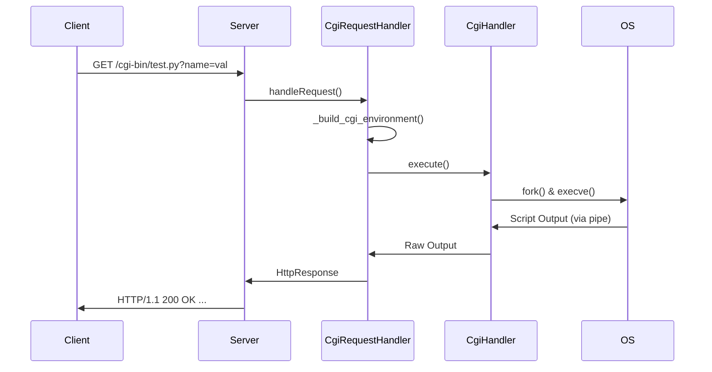

# CGI (Common Gateway Interface)

CGI 是一种标准协议，用于 Web 服务器与外部应用程序（CGI 脚本）之间进行交互。它允许服务器生成动态内容，而不仅仅是提供静态文件。

## 1. 工作原理

当 Web 服务器收到一个指向 CGI 脚本的请求时，它会执行以下步骤：

1.  **识别请求**：根据配置文件（如 `default.conf`）中的 `cgi_path` 或文件扩展名识别出这是一个 CGI 请求。
2.  **准备环境**：服务器设置一系列环境变量（如 `REQUEST_METHOD`, `QUERY_STRING`, `PATH_INFO` 等），这些变量包含了请求的所有细节。
3.  **创建子进程**：服务器使用 `fork()` 创建一个子进程。
4.  **重定向 I/O**：
    *   使用 `pipe()` 创建管道。
    *   将子进程的 `stdin` 重定向到管道的读端（用于接收 POST 请求的 Body）。
    *   将子进程的 `stdout` 重定向到管道的写端（用于捕获脚本的输出）。
5.  **执行脚本**：子进程使用 `execve()` 执行 CGI 解释器（如 `/usr/bin/python3` 或 `/usr/bin/php-cgi`）并运行脚本。
6.  **读取输出**：父进程从管道中读取脚本的输出。
7.  **生成响应**：服务器解析脚本输出的 Header（如 `Status`, `Content-Type`），并将其封装成 `HttpResponse` 发送给客户端。

## 2. 核心环境变量 (RFC 3875)

本项目实现了以下核心环境变量：

| 变量名 | 描述 | 示例 |
| :--- | :--- | :--- |
| `REQUEST_METHOD` | HTTP 请求方法 | `GET`, `POST` |
| `QUERY_STRING` | URL 中 `?` 后面的参数 | `id=123&name=test` |
| `CONTENT_LENGTH` | 请求体的长度（仅 POST） | `42` |
| `CONTENT_TYPE` | 请求体的 MIME 类型 | `application/x-www-form-urlencoded` |
| `PATH_INFO` | 脚本路径后的额外路径信息 | `/extra/path` |
| `SCRIPT_NAME` | 脚本的虚拟路径 | `/cgi-bin/hello.py` |
| `SCRIPT_FILENAME` | 脚本在文件系统中的绝对路径 | `/var/www/cgi-bin/hello.py` |
| `SERVER_NAME` | 服务器的主机名或 IP | `localhost` |
| `SERVER_PORT` | 服务器监听的端口 | `8080` |
| `SERVER_PROTOCOL` | 使用的协议版本 | `HTTP/1.1` |
| `GATEWAY_INTERFACE` | CGI 版本 | `CGI/1.1` |

## 3. 项目实现细节

在本项目中，CGI 的处理主要分布在以下类中：

*   **`CgiRequestHandler`**: 负责高层逻辑，包括环境准备、调用执行器和解析输出。
*   **`CgiHandler`**: (待完善) 负责底层的 `fork`, `execve` 和管道管理。

### 示例流程

## 4. 注意事项

*   **超时处理**：CGI 脚本可能会死循环，服务器需要实现超时机制（如使用 `waitpid` 的 `WNOHANG` 或设置定时器）。
*   **安全性**：执行外部程序存在安全风险，应限制脚本的执行权限和访问范围。
*   **错误处理**：如果脚本执行失败或返回格式错误，服务器应返回 `500 Internal Server Error` 或 `504 Gateway Timeout`。

